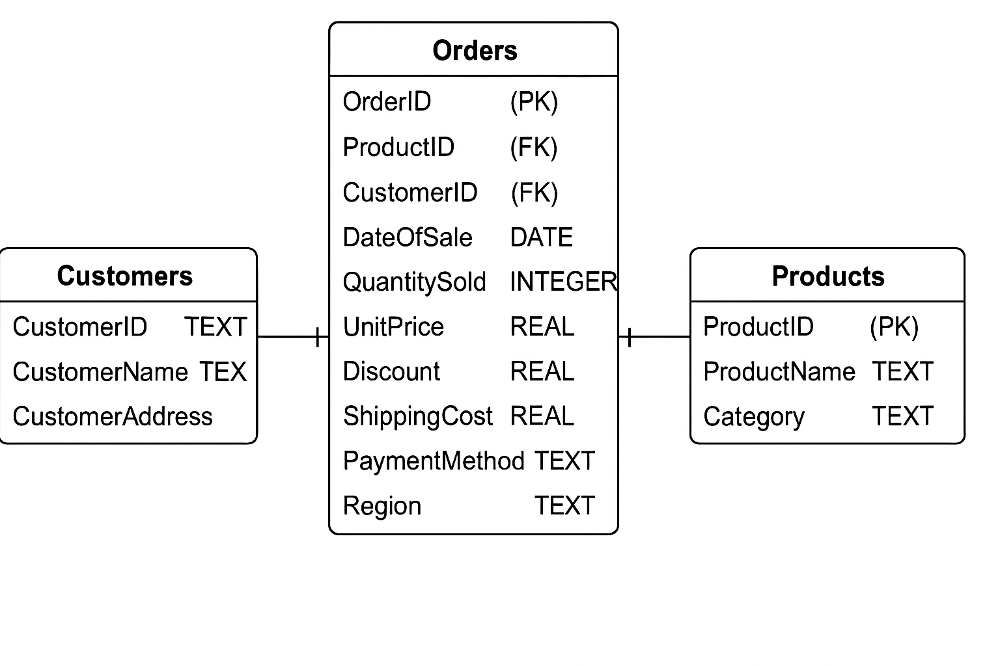

# 📊 Revenue Analytics API


## 🚀 Overview

This is a FastAPI-based backend service for revenue analytics. It processes sales data from a SQLite database and provides endpoints to analyze revenue by product, category, region, trends, and overall summaries. It also supports CSV-based data refresh operations.

---

## ⚙️ Prerequisites

Ensure the following tools and dependencies are installed on your system:

| Tool           | Required Version |
|----------------|------------------|
| Python         | 3.9 or later     |
| pip            | 21.0+            |

### Install Dependencies

```bash
pip install -r requirements.txt
````

**Directory structure**:

```
.
├── main.py
├── database.py
├── data_loader.py
├── requirements.txt
└── README.md
```

### Table Scema

</img>


## 🏃 How to Run the Project

Initialize Database:

Run database.py once to create the database and tables.
```bash
python database.py
```


```bash
uvicorn main:app --reload
```

* The API will be available at: [http://127.0.0.1:8000](http://127.0.0.1:8000)
* Swagger Docs: [http://127.0.0.1:8000/docs](http://127.0.0.1:8000/docs)

---

## 📬 API Reference

| Endpoint               | Method | Body / Params                                               | Sample Response                                                       | Description                                      |
| ---------------------- | ------ | ----------------------------------------------------------- | --------------------------------------------------------------------- | ------------------------------------------------ |
| `/refresh-data`        | POST   | `{"csv_path": "path/to/file.csv", "mode": "append"}`        | `{"message": "Data refresh initiated."}`                              | Triggers a background job to load data from CSV. |
| `/revenue/total`       | GET    | `?start_date=YYYY-MM-DD&end_date=YYYY-MM-DD`                | `{"total_revenue": 14500.25, "start_date": "...", "end_date": "..."}` | Returns total revenue in a date range.           |
| `/revenue/by-product`  | GET    | `?start_date=YYYY-MM-DD&end_date=YYYY-MM-DD&limit=5`        | List of top products with revenue, quantity, and order count.         | Revenue grouped by product.                      |
| `/revenue/by-category` | GET    | `?start_date=YYYY-MM-DD&end_date=YYYY-MM-DD&limit=5`        | List of categories with revenue, quantity, and order count.           | Revenue grouped by product category.             |
| `/revenue/by-region`   | GET    | `?start_date=YYYY-MM-DD&end_date=YYYY-MM-DD&limit=5`        | List of regions with revenue, customer count, and orders.             | Revenue grouped by region.                       |
| `/revenue/trends`      | GET    | `?start_date=YYYY-MM-DD&end_date=YYYY-MM-DD&period=monthly` | Time-series revenue trends by month/quarter/year.                     | Revenue trends analysis.                         |
| `/revenue/summary`     | GET    | `?start_date=YYYY-MM-DD&end_date=YYYY-MM-DD`                | Total revenue, top product, category, and region.                     | Complete revenue summary analytics.              |

---

## 🧠 Design Decisions

* **FastAPI**: Chosen for async support and automatic docs.
* **SQLite**: Lightweight and easy to prototype; can be scaled to PostgreSQL.
* **Pydantic**: Ensures strict request validation and type safety.
* **BackgroundTasks**: For non-blocking CSV loading operations.

---


